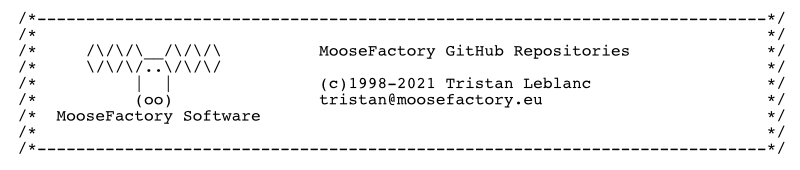

# Public Repositories

## Foundations

### MoofFoundation

A compilation of Swift commons 

[https://github.com/moosefactory/MoofFoundation](https://github.com/moosefactory/MoofFoundation)

### UniColor

A color utilities library, and an option to deal seamlessly with CGColors, NSColor, UIColor, and SwiftUI Color

[https://github.com/moosefactory/UniColor](https://github.com/moosefactory/UniColor)

--

## MIDI

#### SwiftMIDI

**SwiftMIDI** is a simple framework that wraps principal **CoreMIDI** functions, and add few logic and definitions for common midi operations.

[https://github.com/moosefactory/SwiftMIDI](https://github.com/moosefactory/SwiftMIDI)

#### SwiftMIDICenter

The **SwiftMIDICenter** framework adding some more system oriented features like storage and configurations management.

[https://github.com/moosefactory/SwiftMidiCenter](https://github.com/moosefactory/SwiftMidiCenter)

#### MIDICenterApp

**MidiCenterApp** is a SwiftUI application that serves as a laboratory to experiment SwiftMIDI and SwiftMidiCenter frameworks

[https://github.com/moosefactory/MidiCenterApp](https://github.com/moosefactory/MidiCenterApp)

--

## Metal

#### MF Metal Example

A cool MacOS / iOS application that demonstrates the usage of **MoofFoundation/Calculator**

[https://github.com/moosefactory/MF-Metal-Example](https://github.com/moosefactory/MF-Metal-Example)

--

## Objective-C ( Deprecated )

### MFFoundation

A compilation of some of commonly used codes over my years of coding on Mac and iPhone 
Based on Apple Foundation framework.

[https://github.com/moosefactory/MFFoundation](https://github.com/moosefactory/MFFoundation)

### MFCocoa

A compilation of some of commonly used codes over my years of coding on Mac and iPhone 
Based on Apple Cocoa framework.

[https://github.com/moosefactory/MFCocoaExtras](https://github.com/moosefactory/MFCocoaExtras)

###  MoofBezierLibrary 

A fast Bezier path intersection detector

[https://github.com/moosefactory/MoofBezierLibrary](https://github.com/moosefactory/MoofBezierLibrary)

# Author

Tristan Leblanc

[tristan@moosefactory.eu](mailto://tristan@moosefactory.eu)
